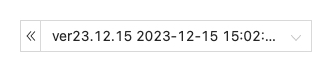
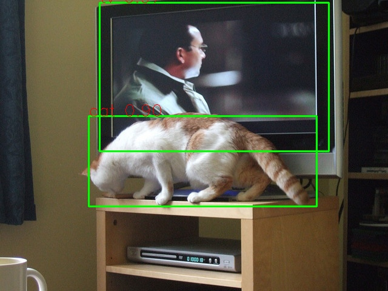

# 一、模型说明
该模型(yolov3)用于目标检测任务，基于PaddleDetection2.6进行模型训练，paddle版本使用2.4.0，输入数据尺寸可以为320x320/416x416/608x608，数据格式为coco格式。 

# 二、效果预览


# 三、使用方式
## 3.1 模型训练

本库已含训练好的模型，并进行了加速处理。

__模型生产基于aistudio平台进行__，确保已有aistudio账号。

aistudio地址：https://aistudio.baidu.com/aistudio/index


### 3.1.1 环境准备

aistudio创建项目, 选择paddle2.4.0版本。

### 3.1.2 模型训练、评估、导出
项目链接：[aistudio项目链接](https://aistudio.baidu.com/projectdetail/6595113?contributionType=1&sUid=1318783&shared=1&ts=1701078320517)


__请参考如下版本__：

## 3.2 模型转换

### 3.2.1 已转换模型
- 本项目已转换好使用coco数据集训练的yolov3-darknet53模型，置于model文件夹内供使用。

### 3.2.2 其他模型
- 若需要转换其他自行训练的模型，请联系百度技术支持同学：ext_edgeboard01@baidu.com

## 3.3 模型部署
__模型部署基于板卡进行__

### Step1：
- 安装opencv依赖库及EdgeBoard DK-1A推理工具PPNC(如已安装，可跳过此步)
  打开终端，执行以下命令安装PPNC。
  ```bash
  sudo apt update
  sudo apt install libopencv-dev -y
  sudo apt install python3-opencv -y
  sudo apt install ppnc-runtime -y
  ```
- 安装PaddlePaddle(如已安装，可跳过此步)
  打开终端，执行以下命令安装PaddlePaddle。
  ```bash
  mkdir Downloads
  cd Downloads
  wget https://bj.bcebos.com/pp-packages/whl/paddlepaddle-2.4.2-cp38-cp38-linux_aarch64.whl 
  sudo pip install paddlepaddle-2.4.2-cp38-cp38-linux_aarch64.whl -i https://pypi.tuna.tsinghua.edu.cn/simple
  ```

### Step2：
下载项目文件
```bash
cd /home/edgeboard/
#下载模型
git clone https://github.com/HengruiZYP/Yolov3-NPU-Acceleration.git
```

### Step3：
安装依赖库，确保当前位于/home/edgeboard/Yolov3-NPU-Acceleration/yolov3-python目录下：
```bash
sudo pip install -r requirements.txt -i https://pypi.tuna.tsinghua.edu.cn/simple
```

### Step4：
同时yolov3的部署额外需要onnxruntime软件，安装：
```bash
sudo apt update
sudo apt install onnxruntime
```

### Step5：
- 配置config.json文件（无更改可略过）
  终端输入以下命令，进入config.json所在目录，并使用vim查看内容。
  ```bash
  cd /home/edgeboard/Yolov3-NPU-Acceleration/yolov3-python
  vim config.json
  ```
- 默认已配置完成，可直接使用，如有自定义，可另行更改配置内容。
  ```json
  {
      "mode": "professional",
      "model_dir": "./model", 
      "model_file": "model"
  }
  ```

    - mode: 固定为"professional"
    - model_dir：传输至板卡的模型文件(model.json、model.nb、model.onnx、model.po)的目录
    - model_file: 传输至板卡的四个模型文件的文件名，固定为model
  键盘输入“:q”，回车退出。

### Step6：
尝试ppnc推理
- 确保当前位于/home/edgeboard/Yolov3-NPU-Acceleration/yolov3-python目录下：
    ```shell
    sudo python3 tools/infer_demo.py \
    --config ./model/config.json \
    --infer_yml ./model/infer_cfg.yml \
    --test_image ./test_images/000000025560.jpg \
    --visualize \
    --with_profile
    ```

    命令行选项参数如下：

        - config: 上文建立的config.json的路径
        --infer_yml: 模型导出时生成的infer_cfg.yml文件
        - test_image: 测试图片路径
        - visualize: 是否可视化，若设置则会在该路径下生成vis.jpg渲染结果，默认不生成
        - with_profile: 是否推理耗时，若设置会输出包含前处理、模型推理和后处理的总耗时，默认不输出

- 查看工程目录，若得到结果如下：vis.jpg
  
  证明模型已经部署成功
  
  
  
### Step7：
接入摄像头识别
- 插入摄像头
  ```bash
  ls /dev/video*
  #查看摄像头是否正常
  ```
  正常情况应该如下：
  
  
  
- 摄像头的代码在infer_demo_vedio.py，输入如下指令，即可开启摄像头识别
  ```bash
  cd /home/edgeboard/Yolov3-NPU-Acceleration/yolov3-python
  sudo python3 tools/infer_demo_vedio.py --visualize
  ```


